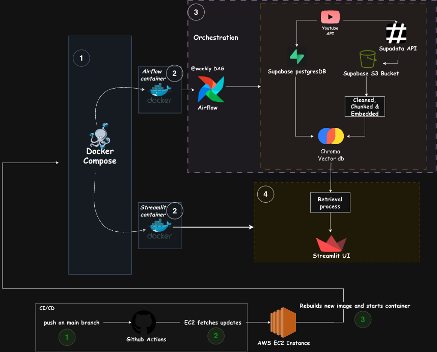
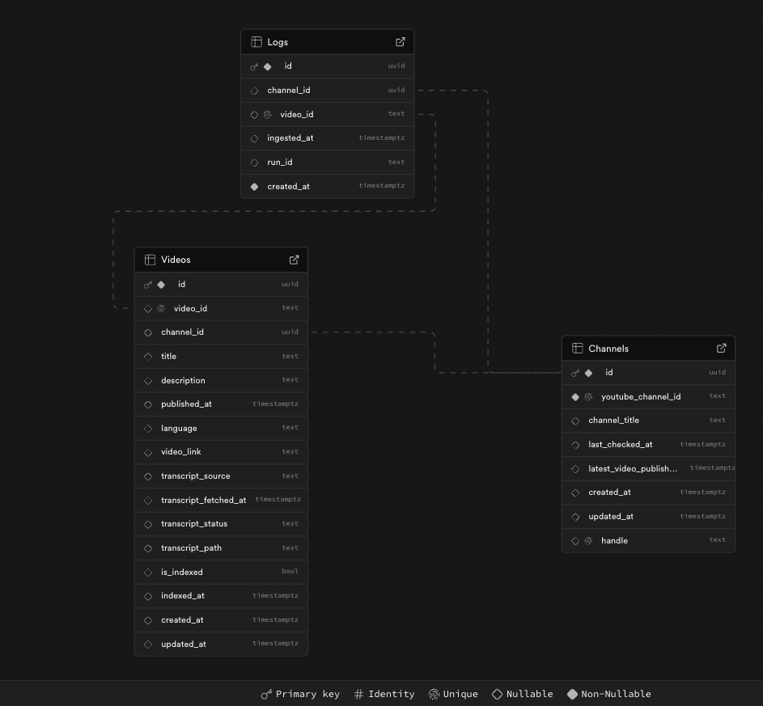

# Tech Product Expert

Struggling to decide what gadget to buy? Watching multiple 20-minute videos from tech enthusiasts who may have been paid to promote certain products can be exhausting. My goal is to provide unbiased information about tech products and reduce the time spent trying to decide what phone, laptop, camera, or GPU is best.

This project uses data from YouTube channels I personally respect and believe are unbiased.

🌐 **Live demo:** [www.techtalkrag.com](http://www.techtalkrag.com)

# Project Architecture



# Pipeline Breakdown

### Data Ingestion

This is the foundation of the project. YouTube data is extracted using the Google API client library, which provides metadata such as video links, upload dates, and titles. Pagination is handled by looping through `nextPageToken` until no further pages exist.

Transcripts are generated using the Supadata API (not sponsored).

Supabase is used for storage. Raw transcripts are saved in a Supabase bucket, while structured metadata is stored in three tables: videos, channels, and logs. Raw transcripts are stored in object storage because they are large text files and cheaper to store compared to relational tables.

#### Challenges faced

Handling pagination for channels with different page lengths, implementing deduplication using `video_id` to prevent reprocessing, and building robust error handling for Supadata (missing transcripts, server errors, and rate limits). I implemented exponential backoff retries and logged failures in the logs table for monitoring.

### Database Relationship



### Data Processing

Cleaning is minimal because the transcripts are already fairly clean. Regex is mainly used to remove special characters and sponsored sections. Sponsored segments are detected using keyword patterns such as *“sponsored by”*, *“thanks to”*, and brand mentions, and entire sentences containing these phrases are removed.

Once cleaned, the transcripts are prepared for vector storage. Instead of embedding the full transcript as one block, the text is chunked into smaller pieces to improve retrieval accuracy.

For chunking, I used **semantic chunking** with LlamaIndex’s SemanticSplitter. This approach groups sentences based on meaning rather than fixed length. I tested character-based chunking but it caused context loss, and agentic chunking introduced noise, so semantic chunking gave the best retrieval quality.

Each chunk is embedded and stored in ChromaCloud. An `is_indexed` flag in the Videos table prevents already processed videos from being re-indexed.

#### Challenges faced

Choosing the optimal chunking strategy and building logic to track indexed videos.  
Reference: [guide on chunking](https://medium.com/@sayantanmanna840/rag-chunking-strategies-with-llamaindex-optimizing-your-retrieval-pipeline-6fdb9f0d50c2)

### Indexing

Indexing runs as part of the Airflow pipeline after ingestion and cleaning. Embeddings are generated for each chunk and stored in ChromaDB along with metadata such as video_id, channel name, and publish date. The `is_indexed` flag ensures idempotency.

### Retrieval

Since tech products are released frequently, I implemented time-aware retrieval logic. The system detects temporal keywords such as *latest*, *newest*, *current*, and also parses years using regex.

Example:
**Query:** “What is the latest iPhone?”
**Answer:** iPhone 17 (as of January 2026), not iPhone 16.

If no time intent is detected, retrieval falls back to similarity-based top-k search. Metadata filters ensure only relevant and recent videos are considered. Conversational memory is implemented using a buffer to maintain context across turns.

#### Challenges faced

Designing reliable time-aware logic that adapts to different product release cycles.

### Apache Airflow

Airflow handles orchestration. A weekly DAG runs the full pipeline:

1. Fetch new videos
2. Fetch transcripts
3. Clean data
4. Index into vector store

Retries and logging are configured at task level.

#### Challenges faced

Setting up and configuring the Airflow environment.
 
<br>

## Deployment

### Docker

Docker Compose runs multiple containers:

* Airflow (scheduler, workers, DAGs)
* Frontend Streamlit app

Docker Compose was chosen to mirror production locally and simplify orchestration.

#### Challenges faced

Configuring Airflow properly inside Docker.

### CI/CD with GitHub Actions

CI runs on pushes to `main` and `demo` branches. Tests must pass before Docker images are built.

CD runs on `main` branch. Images are built, pushed to the registry, and EC2 pulls the latest version automatically.

## AWS EC2

The GitHub repository is cloned onto an EC2 instance. On each deployment, the instance pulls the latest Docker images and restarts containers. Nginx is configured as a reverse proxy to route traffic to the frontend application.

An Elastic IP is attached, and a custom domain purchased from Namecheap is mapped to the instance.


[Helpful setup guide](https://www.youtube.com/watch?v=gji0AW6CmHY)

## Tech Stack

**Frontend:** Streamlit  
**Backend:** Python, Supabase (PostgreSQL database & Storage bucket), Apache Airflow  
**AI Services:** OpenAI text-embedding-3-small for text embeddings  
**Deployment:** AWS EC2, Docker, GitHub Actions  


## Additional Key Features

**Automated video tracking:**  
New videos are automatically detected and processed on each scheduled run, ensuring the system stays up to date without manual intervention.


**Robust API error handling**   
Gracefully handles missing transcripts, server errors, and rate limits using retries and exponential backoff.

**Metadata-aware retrieval**   
Stores and uses video metadata (publish date, channel, video ID) to improve filtering and ranking of search results.


**Conversational memory**  
Maintains short-term chat memory so users can ask follow-up questions naturally.


**Time-based result filtering**  
Filters older videos when queries imply recency (e.g. *latest*, *current*).

**End-to-end automation**  
From ingestion → cleaning → chunking → embedding → retrieval, everything runs automatically through Airflow.


## Setup

Prerequisites:
- Python 3.11
- Supabase
[database guide](https://supabase.com/docs/guides/database/overview)
- Supadata 
[guide](https://supadata.ai/)
- OpenAI API Key
[guide](https://platform.openai.com/docs/quickstart)
- ChromaCloud
[guide](https://docs.trychroma.com/cloud/getting-started)
- AWS Account

## Local Development

### 1. Create `.env` file in `airflow-docker`

```bash
AIRFLOW_UID=
API_KEY=
OPEN_API_KEY=
SUPADATA_KEY=
SUPABASE_KEY=
SUPABASE_URL=
API_KEY_CHROMA=
CHROMA_TENANT_ID=
database=
```

### 2. Start up docker containers  

From the project root, run:  

```bash
docker-compose up -d --build
```
This start up:  
- Airflow (scheduler + workers)  
- Backend pipelines  
- Frontend Streamlit app   
<br>

Check that everything is running:  
```bash
docker ps
```
to check if all containers are running properly


## Project Overview  
```bash
Tech_Product_Expert/
│
├── .github/
│   └── workflows/
│       ├── ci.yml                 # CI pipeline (tests + build)
│       └── cd.yml                 # CD pipeline (deploy to EC2)
│
├── airflow-docker/
│   ├── config/                    # Airflow configuration
│   ├── dags/                      # Airflow DAG definitions
│   ├── logs/                      # Airflow logs
│   ├── plugins/             
│   ├── .env                       # Airflow environment variables
│   └── docker-compose.yaml        # Airflow + services orchestration
│
│
├── resources/
│   ├── ETL_diagram.png            # Architecture diagram
│   └── supabase_database.png      # Database schema diagram
│
├── tests/
│   ├── test_rag_indexing.py
│   ├── test_rag_retrieval.py
│   └── test_youtube_ingestion.py
│
├── app.py                         # Streamlit frontend
├── youtube_ingestion_pipeline.py  # YouTube metadata ingestion
├── supadata_transcript_fetcher.py # Transcript extraction
├── rag_indexing_pipeline.py       # Chunking + embedding + vector storage
├── rag_retrieval.py               # Query logic + time-aware retrieval
│
├── requirements.txt              
├── Dockerfile                     # Streamlit app container
├── Dockerfile.airflow             # Airflow container
├── Makefile                       
├── pytest.ini                     
│
├── .env                        
├── .gitignore
├── .dockerignore
│
└── README.md
```

## Limitations   
- Currently, the application does not support user authentication, so conversation history is not persisted across sessions. Once a user refreshes the page or closes the browser, previous chats are lost.  
- While time-aware retrieval improves freshness, it is based on heuristic keyword detection. Queries that imply recency without explicit temporal words may not always trigger time filtering correctly.  
- Vector search performance depends on the size of the dataset. As the number of indexed videos grows, retrieval latency may increase without further optimization.

## Future work

- Add user accounts so conversations can be saved and resumed across sessions.  
- implement knowledge graph to create more accurate, context-aware AI
- Retrieval speed optimization